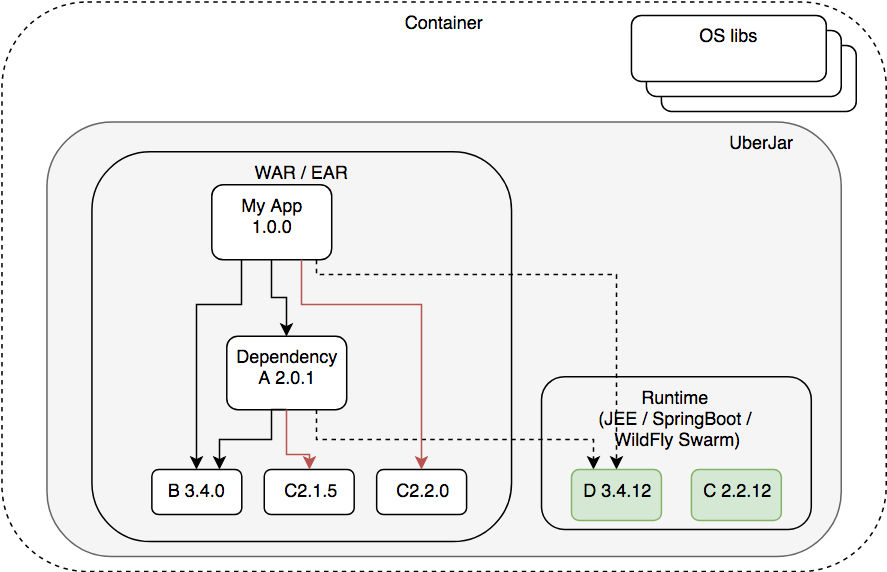

Providing Long Term Support for your products
=============================================

.footnote[
Matej Lazar
- OpenBlend, RedHat
- https://github.com/matejonnet/
- matejonnet@gmail.com
]

???

Visit [http://matejonnet.github.io/presentations/providing-lts-for-your-products/](http://matejonnet.github.io/presentations/providing-lts-for-your-products/) to see slides in presentation mode.

---

Agenda
======

### - When we speak of LTS

### - Security bottom UP

### - Use case

### - Application level security

### - Maintenance Risk

### - Improving maintainability

### - Microservices

### - Conclusion

---

Supported product
=================
- Product in production
- Being able to fix the bugs and ecurity exploits
- Potentially no active development

---

Security bottom UP
==================
- OS (keep it updated)
- App server
- Frameworks / Custom Libraries
    - eager to pick any
    - Potentially use native components
- Our Application
- Containerized application (Docker like images)

CVE lists (eg. https://nvd.nist.gov/)

---

Use case
========

[Example schema @ draw.io](https://www.draw.io/?lightbox=1&highlight=0000ff&edit=_blank&layers=1&nav=1&title=dependency-example.xml#R7Vptj9o4EP41SHdfUGInvHxcKNtT1eqqotO2H03iDb6GOGfMAv31Zyd23hwCgcCxOljtrj2eTOx5nhmPE3pwutp9ZChefqE%2BDnvA8nc9%2BKEHgA3HjvgnJftUMhyMU0HAiK%2BUcsGc%2FMJKaCnphvh4XVLklIacxGWhR6MIe7wkQ4zRbVntlYblu8YowIZg7qHQlL4Qny9T6ci1cvkfmARLfWfbUiML5P0MGN1E6n49AF%2BTTzq8QtqW0l8vkU%2B3BRGc9eCUUcrT1mo3xaH0rXZbet3zgVE4SM2%2BoXCjliJcxBGJMNNTZzjip9gCY8PWtGxrzffaYWIdsWzinbA9SRyApR1b9JZ8Farmdkk4nsfIk7pbwR0h89F6mem%2BkjCc0pCyxKz2HZwEDPlETFyPRTQSJiYoJEEkup4YErOCkzfMOBE4PqkBTuUtzKVnjhL6eFcAXfniI6YrzNleqOhRDbGitObCNueHO1ayZYEbcKSESHEyyEznzhcN5f8DuDoGFl1CUPS68uwBh9f714BhSRn5Jcmi7xqiBQ6%2F0jXhhNYC9rmisCK%2BL1fWCXauU8ZuODaws2ENdo7TAXTwZtCdEDDvFD9Yxm9wS%2FyAgd%2Bfc9EPyWL9ALItkKCSRG8IpIljDwxCiZNP3qRt5Tsh%2FWdDE%2FySCWRd0Qrk%2F78WmH1CYg8coJV0erRYp5vMrfuWXsCC6blpiXBGsiotvR5PXflzlJCpKzvl45oz%2BhMXpjJIPl1t95WUk%2FWL%2B30dVcG4i%2F3eNcjKNhEnK9y2itNTLFj6pi3V8Oe3T7NZMvAs%2Fs5jRqJgIotRLTKveCGh%2FxxKz823iK1%2Bv3Jdcvu8Z%2FDMSj71PHPb8swZlHkGLZNn9qiGZ7YFOuCZbdb4ogv6oG9fs0zxXTzynfuAcwQW8FDaaA2nW4VzAAw4B3WnhC42OGgghn1xrFVdyviSBjRC4SyXFlC0yijiHeHfpbg%2FdFX3hx6KxMzSMeDq%2Fg9l4m%2FM%2BV6d6NGGUyHK7%2FyZSnwTI6Vj32HXr%2BmGeWo1ykccsQDrbKvcKxfaiA%2FDIeLkrXy%2Br%2FN2cukTY2hfUIgpifi6YPmrFOSwQ7sCuwPKWbmi74zdJn3RSGeQ454t5TQqOJ1SIcf7lnDb7rvBW58SDuHtNutfjrdZ3IpfC%2FadRx4%2Fb1se%2FXd5HA4NMF%2BevmUl2Ey2%2F7fPflojaVd2ZLvmwR2oK7AyfC%2FB0qyvUByby2qu4c2Hfx9wjAXEkScX%2BpRUbFbfvmKgv4fHEXZbamTPcHVWHkKDGnXMcMaXE8OM8YlK2NYDxpYwWmfm6g7ie9RpnZWV3A0V9%2FDsEuygq4%2FU2MO7KLlAdUc%2BUmID57olds3bMXFo7rsGIR7R2xy9wwpON4xe28y11w7fs6O3yoWRhz2vrg5ejFzHrX88dVq8j%2B8j3seVeHeb4x1abpP%2BxfFuD94PV05Cvu547XQN%2FcmROLyOd0HVvae6sAmGs917nZ3UCAW7UtfCISibSOekrspBah2ilaMVOBKiADbqXx6i5luTL8kBSR65qu8tbHFiepTabTfryhcpbM2sIycmt4vNurbiAg8Q24IIq%2BnhhhUXuFLF1fSO4t5Krrqdwb6Pogta7TI6HHWa0UU3%2F%2Bpjqp5%2FvxTO%2FgU%3D)

---

Application level security
==========================
- Our bugs
- Public CVE in dependencies
    - we might need to fix it on our own
- Which libraries are used in our applications
- Choosing the right runtime environment (lts)
- Dependency managers
    - Not always good
    - Maven (provided vs. runtime)
- Dependency repositories
    - Maven Central
    - User’s Github scm repositories (npm)

---

Maintenance Risk
=================
- Knowledge (how)
    - Know how to fix
    - Know how to rebuild/redeploy a product (what is a build script)
    - New team (logs, tracking records, documentation)
    - Know what is used in the application / service
	- Are the dependencies still available
- Environment (where)
    - New (build) servers
    - Miss some system library
    - Missing public/private repositories
    - Which environment is required (Java/maven version, native libs)
- Easy maintainable system

---

Improving maintainability - Logical
=========================
- Minimize number of different libraries (see use case)
    - Use provided
    - Align versions cross products
- Keep record of used libraries
    - Monitor for CVE
- Supported dependencies
    - Slow releases
    - Costs
- Use Maven BOM / shared parent
- Automatic alignment

---

Improving maintainability - System
=========================
- Build on the CI (Jenkins etc.)
    - stored configuration
    - Store all build results (logs, workspace)
- Use local repository manager (proxy)
- Use http proxy (https ?)
- Well defined Build environment (tooling and versions)
- DB for product and dependency relations
- Don't build on users PC

---

Containerised applications and Microservices
========================
- Spring Boot / Thorntail / Quarkus
    - Many more applications
    - OS update requires container rebuild
        - application rebuild ?
    - AppServer update
    - Our application update
        - Rebuild the images

---

PNC
===
- Build in clean and isolated environment
    - Preinstalled required Installed tolling
- Keep track of all downloaded dependencies and store them
- Maven repository manager
    - Proxy (store public artifacts)
    - Hosting (our builds)
- Npm registry
    - Proxy (store public artifacts)
    - Hosting (our builds)
- Http proxy

---

3 levels of LTS
===============
1. Know for all the runtime dependencies used in production
2. Have runtime libs sources and compile time dependencies
3. Know how to rebuild all runtime libs

---

Thanks
======

### PNC
- [https://github.com/project-ncl/pnc](https://github.com/project-ncl/pnc)

### Presentation tool used
- https://github.com/gnab/remark/

### Questions
- matejonnet@gmail.com
